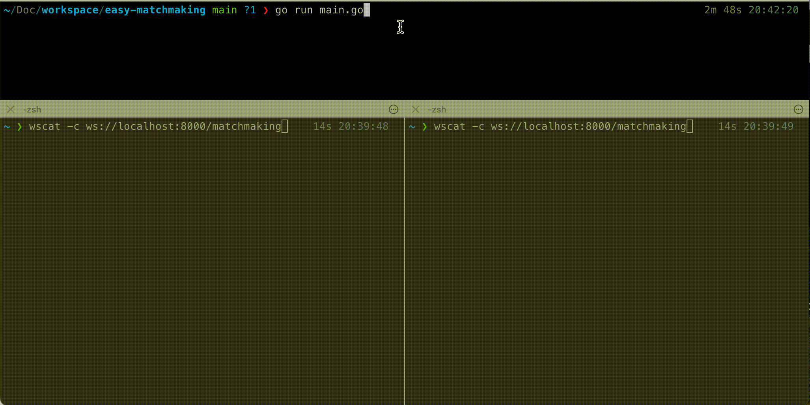

# easy-matchmaking
Simple WebSocket server implemented in Go and dedicated for P2P matchmaking.

## Demo



The following is being used as the backend service. Please try it out.   
https://p2p-chat.pages.dev

## Usage
Server start (defalt listen port: 8000, change -flag option)
```bash
go run ./main.go
```

Prepare two WebSocket clients, and perform the following commands on both of them (Websocket cli using: [wscat](https://github.com/websockets/wscat))
```bash
$ wscat -c ws://localhost:8000/matchmaking
Connected (press CTRL+C to quit)
> {"user_id": "test-user1", "created_at": "2099-12-31T23:59:58+00:00"}
# if you matching:
< {"type":"MATCH","room_id":"68be89f","user_id":"test-user2","created_at":"2024-05-29T20:43:03.897592+09:00"}
```

# Enviroment Value
| KEY | Description |
| --- | --- |
|SLACK_WEBHOOK_ENDPOINT| If you specify a Slack webhook endpoint, a message will be delivered when a user enters.|